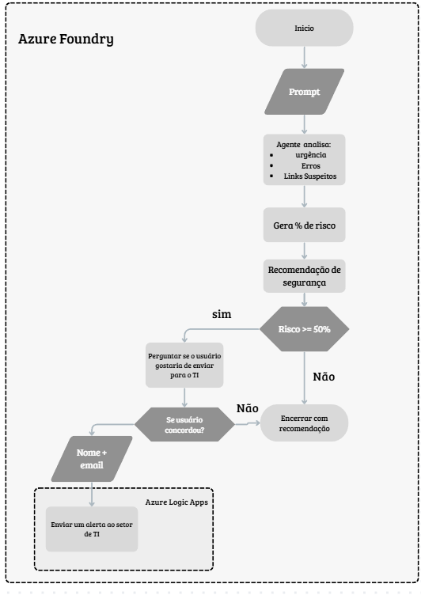
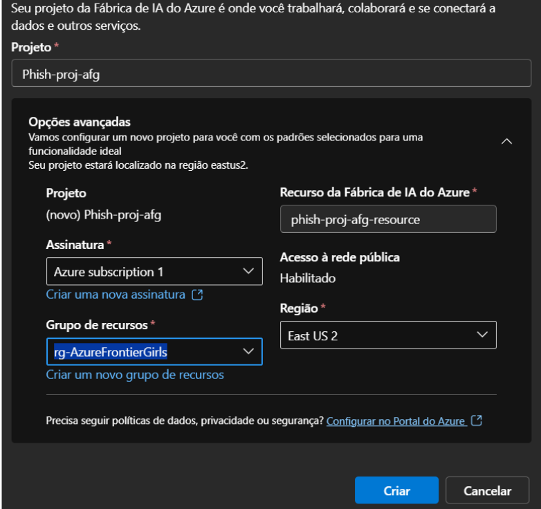

#  **PhishDetect AI – Azure Frontier Girls Challenge**

O **PhishDetect AI** é um agente desenvolvido para identificar automaticamente possíveis tentativas de phishing dentro de ambientes corporativos. Ele analisa o conteúdo textual do e-mail, detectando sinais suspeitos como urgência exagerada, erros gramaticais, tom emocional incomum, pedidos fora do padrão e links/dominios que não correspondem ao remetente declarado.

A partir dessa análise, o agente gera uma porcentagem de risco, explica os fatores que influenciaram essa avaliação e recomenda ações de segurança ao usuário.
Quando o risco ultrapassa **50%**, o agente pergunta ao usuário se deseja encaminhar o e-mail para o setor de TI. Caso o usuário aceite, o agente gera automaticamente uma mensagem estruturada contendo os dados necessários para investigação interna.

---

##  **Objetivos**

O *PhishDetect AI* tem como objetivo auxiliar empresas a identificar e mitigar possíveis tentativas de phishing através de:

* Análise semântica do conteúdo do e-mail
* Classificação de risco (0%–100%)
* Explicação dos fatores detectados
* Recomendações imediatas de segurança
* Encaminhamento opcional ao setor de TI
* Inclusão do corpo original do e-mail suspeito para análise profissional

---

##  **Funcionalidades Principais**

* **Classificação percentual de risco** (ex.: *87% — possível phishing*)
* **Resumo explicativo dos fatores encontrados**

  * Ex.: “link suspeito + urgência + domínio inconsistente”
* **Detecção e marcação de links e domínios suspeitos**
* **Interface simples para entrada do texto do e-mail**
* **Pergunta automática ao usuário sobre envio ao TI quando o risco é alto**
* **Geração automática do alerta** contendo:

  * Nome completo do usuário
  * E-mail do usuário
  * Remetente suspeito
  * Corpo completo do e-mail analisado

---

## **Entrada e Saída**

### **Entrada**

* Texto do e-mail contendo remetente, assunto e corpo da mensagem.

### **Saída**

* Percentual de risco
* Explicação do motivo
* Recomendações de segurança
* *(Opcional)* Alerta estruturado para o TI, caso o usuário autorize

---

##  **Configuração do Ambiente e Ferramentas Utilizadas**

### **Modelo Utilizado**

**GPT-4o Mini**, escolhido por:

* Baixo custo
* Excelente velocidade
* Disponibilidade estável na região **East US 2**

### **Tipo de Implantação**

* **Global Standard Deployment**

---

##  **Tecnologias**

### **Azure AI Foundry (GPT-4o Mini)**

Criar, configurar e executar o agente de IA responsável pela análise de phishing e pela interação com o usuário.

### **Azure Logic Apps**

Automatizar o envio do e-mail para o setor de TI quando o usuário autoriza.
É responsável por montar e enviar o alerta final.

### **Azure SQL Database** *(opcional — usado somente em testes)*

Fornece armazenamento relacional, caso haja necessidade de registrar dados ou históricos.

### **GitHub**

Repositório oficial, hospedagem e documentação do projeto.

---

##  **Instrução do Agente (Prompt Principal)**

> Você é um agente que analisa e-mails suspeitos. Sempre avalie o e-mail recebido, gere uma porcentagem de risco entre 0% e 100%, avaliando sinais de phishing como urgência, erros gramaticais, linguagem emocional exagerada, pedidos incomuns de ação, links suspeitos ou inconsistentes com o domínio do remetente. Explique rapidamente o motivo da pontuação e dê recomendações de segurança.
>
> Se o risco for maior que 50%, pergunte ao usuário se ele deseja encaminhar ao TI.
>
> Se o usuário disser que sim, peça o nome completo e o e-mail. Depois gere:
> **“[nome] ([e-mail]) recebeu um possível phishing de [remetente] e solicita verificação do setor de TI.”**
>
> Inclua também o corpo completo do e-mail original.
>
> Se o usuário disser que não deseja encaminhar, finalize apenas com orientações, sem gerar nenhuma mensagem externa.

---

##  **Fluxo da Solução**

1. O usuário fornece o texto do e-mail ao agente.
2. O agente analisa o conteúdo, detecta sinais suspeitos e calcula o risco.
3. O agente explica os fatores e recomenda medidas de segurança.
4. Caso o risco seja **maior que 50%**, o agente pergunta se o usuário deseja encaminhar ao TI.
5. Se o usuário concordar, o agente solicita nome completo e e-mail.
6. O Logic App recebe os dados e envia o alerta automático ao time de TI.
7. O setor de TI recebe:

   * Nome do usuário
   * E-mail do usuário
   * Remetente suspeito
   * Corpo completo da mensagem analisada
 
    

---
## Criação do Agente

## Configurações do agente

##  **Referências**

* [https://www.malwarebytes.com/pt-br/phishing](https://www.malwarebytes.com/pt-br/phishing)
* [https://prodest.es.gov.br/entenda-o-que-e-phishing-e-adote-medidas-para-evita-lo](https://prodest.es.gov.br/entenda-o-que-e-phishing-e-adote-medidas-para-evita-lo)
* [https://www.cloudflare.com/pt-br/learning/email-security/how-to-prevent-phishing/](https://www.cloudflare.com/pt-br/learning/email-security/how-to-prevent-phishing/)
* [https://www.mcafee.com/blogs/pt-br/internet-security/exemplos-de-e-mail-de-phishing-como-reconhecer-e-mails-de-phishing/](https://www.mcafee.com/blogs/pt-br/internet-security/exemplos-de-e-mail-de-phishing-como-reconhecer-e-mails-de-phishing/)

---

